# front-end-designer

> 毕设项目-可视化网站布局工具。基于Vue，详细参考[guide](http://vuejs-templates.github.io/webpack/) 、[docs for vue-loader](http://vuejs.github.io/vue-loader)。

## 使用

创建数据库：运行[脚本](https://github.com/zhaoluting/front-end-designer/blob/master/front-end-designer_2018-07-21.sql)

``` bash
# 安装依赖
npm install

# 运行项目
npm run dev

# 打包
npm run build

```

## 项目介绍
### 1. 登陆注册模块
#### 1.1 用户登陆
登陆界面如图1-1所示，用户在输入用户名和密码后可以点击“登录”按钮登陆，用户名和密码输入框具有校验功能，用户名不得为空，密码长度至少为3位。  
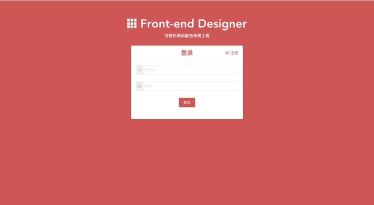

#### 1.2用户注册
新用户可以点击注册按钮进入注册页面，在注册页面选择角色、输入用户名，密码和邮箱后即可进行注册。用户名、密码和邮箱输入框具有校验功能，用户名、邮箱不得为空，密码长度至少为3位。注册界面如图1-2所示。  
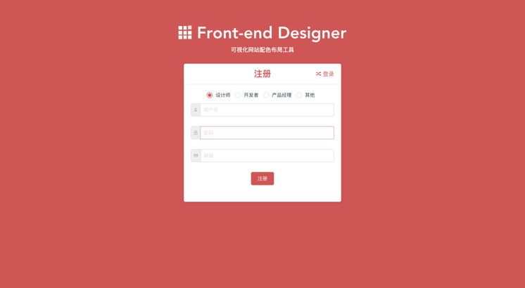

登陆后进入系统首页界面。如图1-3所示。  
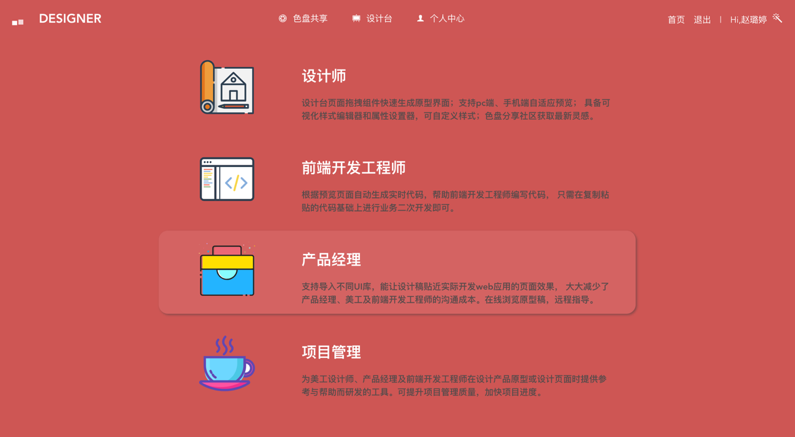

### 2. 色盘共享模块
#### 2.1色盘查看
用户可在色盘共享界面查看所有用户提交的色盘，点击每个色盘右上角的预览按钮，即可查看色盘的详细信息。
同时，系统支持根据关键字按名称或者作者模糊搜索色盘、按时间或热度排序，快捷查看“我”发布的色盘。
色盘共享界面如图2-1所示。
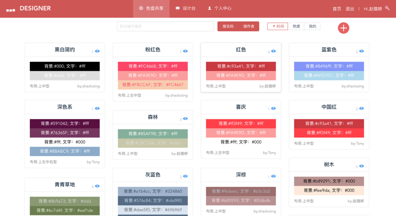

查看色盘详细信息界面如图2-2所示。
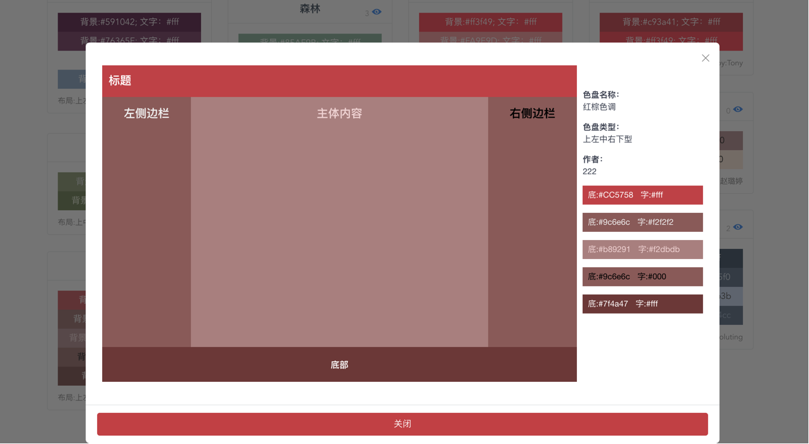

#### 2.2色盘创建与发布
用户点击页面右上角的加号即可快速创建、发布色盘。创建面板左侧是预览模块，右侧是编辑模块，填写名称、选择色盘类型、设置完成各部分颜色后，点击右上角的保存即可发布色盘。色盘创建界面如图2-3所示。
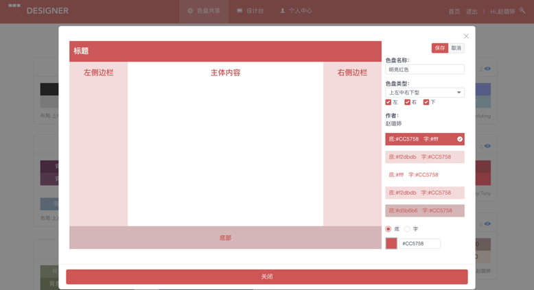

#### 2.3色盘编辑
点击每个色盘右上角的预览按钮查看色盘的详细信息时，若是本人创建的色盘，面板右上角就会出现“修改”、“删除”按钮。点击“修改”按钮就会进入编辑模式，样式同“色盘的创建与发布”。点击“删除”就能将色盘删除。色盘编辑界面如图2-4所示。
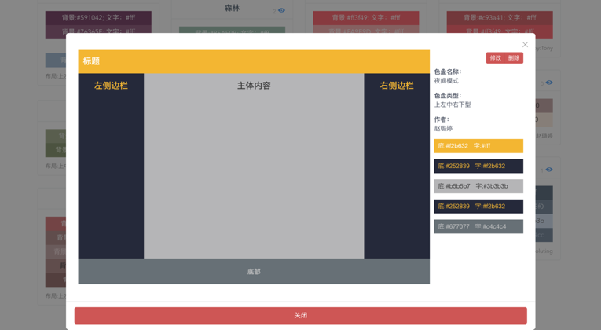

### 3.设计台模块
#### 3.1拖拽、自定义生成网页模板
设计台主要分成三大块，左侧为属性配置面板，中间为预览面板，右侧为组件库面板。用户可在右侧面板中选择组件类型，点击并拖拽到中间面板的指定位置，在左侧对击中的组件进行属性配置，快速生成网页模板。
1. 属性面板（左侧）
- 展示类型选择为“属性”时，可对选中组件属性进行可视化配置。
- 展示类型选择为“组件树”时，可直观看到各个组件的嵌套情况。

2. 预览面板（中间）
- “代码”按钮：展开代码面板，展示当前模板页面的所有代码。
- “下载”按钮：下载当前模板页面代码到本机。
- “样式”按钮：展开样式面板，可编写css代码，设置复杂交互。
- “视图”按钮：可切换预览面板的宽度，还可在“手机模式”和“pc模式”之间切换。
- “清空”按钮：将当前页面清空。
- “全屏”按钮：将整个页面设置成全屏。
- “撤销”按钮：当进行“删除”操作后会出现“撤销”按钮，可撤销上一步。
- 右键操作：组件右键弹出菜单：“复制”、“粘贴”、“删除”。

3. 组件库面板（右侧）
- 选择“组件类型”：默认有三种四种组件库（muse-UI、mint-UI、iView-UI、Common）。

4. 顶部导航栏（三个图标按钮）
- 保存当前页面：当该模板不属于任何一个项目时，会弹出快捷创建模板页并选择项目的弹窗；当模板属于某一项目时，就会直接将当前模板页保存下来。
- 页面相关设置：可配置设计台的相关设置项。
- 分享当前页面：会生成“设计地址”与“预览地址”，供转发给他人查看该模板。

pc模式下设计台的整体界面如图3-1所示，预览面板中的预览效果与pc端一致，采用的组件是pc端通用组件库。
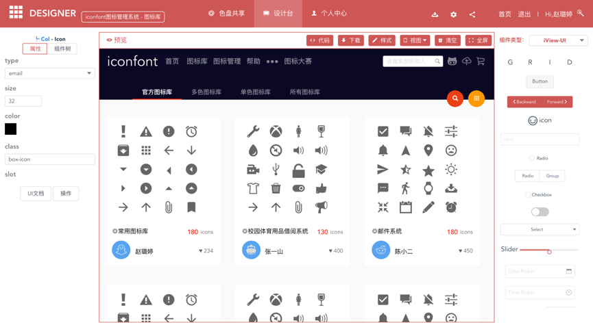

手机模式下设计台整体界面如图3-2所示，预览面板中的预览效果与手机端一致，采用的组件是手机端通用组件库。
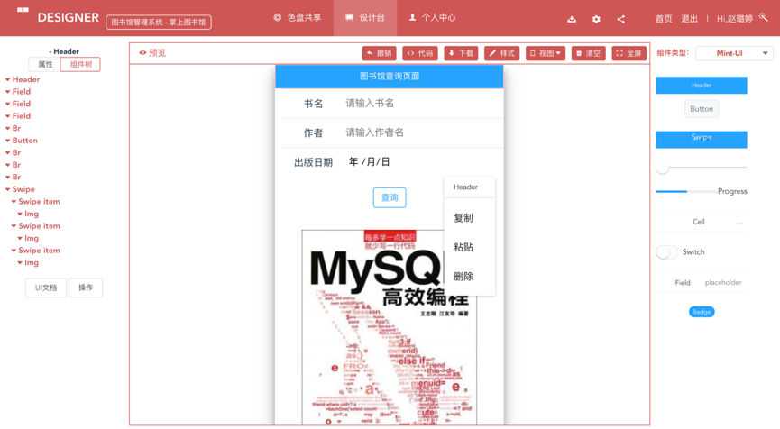

点击“代码”按钮就可展开代码面板，展示当前模板页面的所有代码。设计台代码面板如图3-3所示。
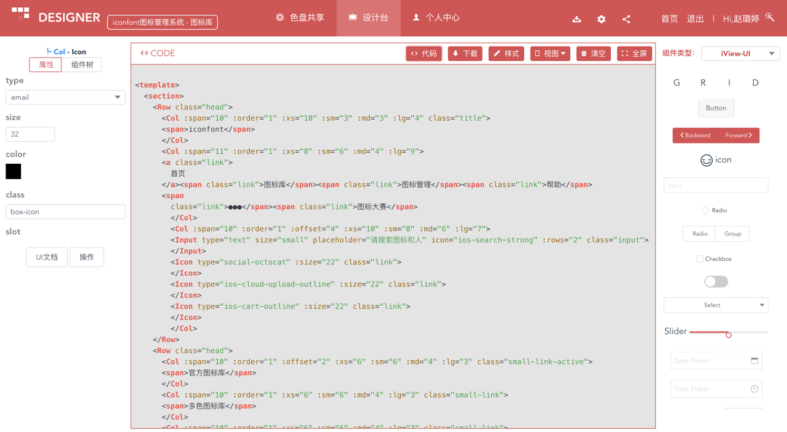

点击“样式”按钮就可展开样式面板，编写css代码，设置复杂交互。设计台样式面板如图3-4所示。
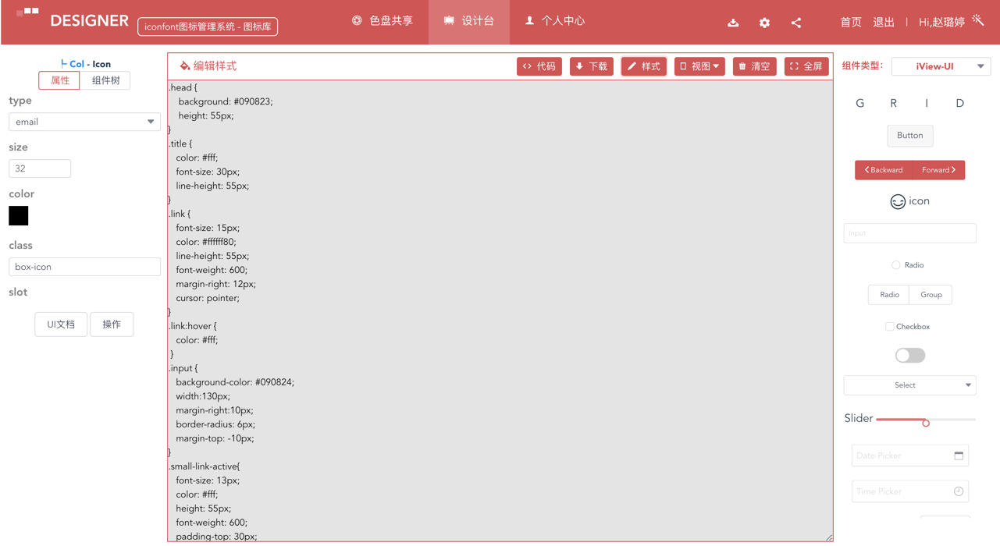

#### 3.2 实时预览
用户除了可以在中间的预览面板中实时查看当前模板页面的设计状态，还可以点击导航栏顶部的分享图标，得到模板页面的“预览地址”，即可直接成品，看到更直观的模板网页。预览界面如图3-5所示。
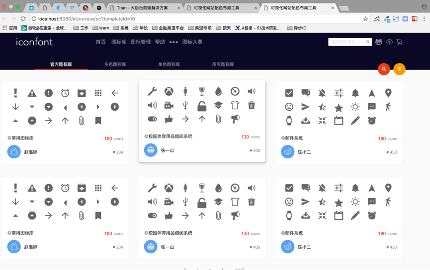

### 4.个人中心模块——个人管理
用户点击“个人中心”左侧的“个人资料”面板，即可对用户信息进行修改，包括用户名、密码、邮箱和用户类型。修改个人资料界面如图4-1所示。
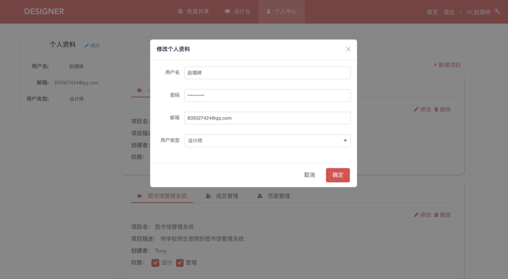

### 5.个人中心模块——项目管理
“个人中心”页面右侧是“设计台管理”面板，用户可查看加入的所有项目，用户点击“新建项目”按钮即可新建项目。新建项目界面如图5-1所示。
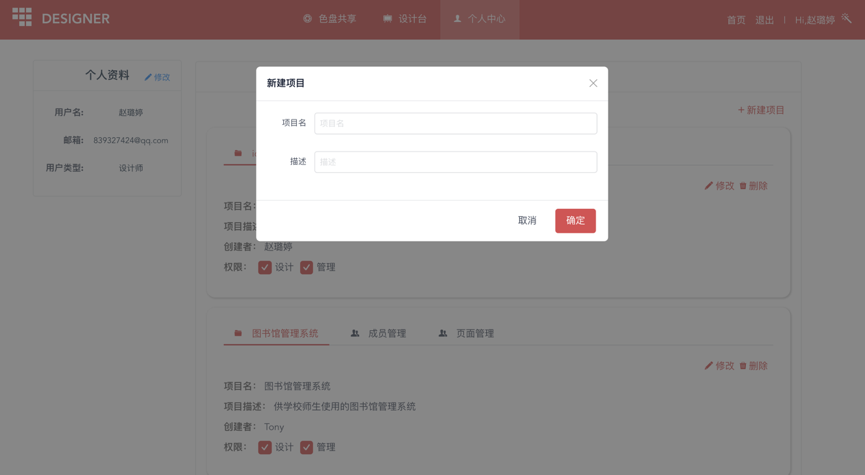  

每个项目面板分成三个部分：“项目详情”、“成员管理”、“页面管理”。
“项目详情”板块展示项目名、项目描述、创建者及用户在该项目中的权限。当用户有管理权限时可对项目修改与删除。项目详情板块如图5-2所示。
  

点击“项目详情”板块右上角的“修改”按钮，会弹出“修改项目”弹窗，点击“确定”按钮即可对项目详情进行修改。项目详情修改弹窗如图5-3所示。
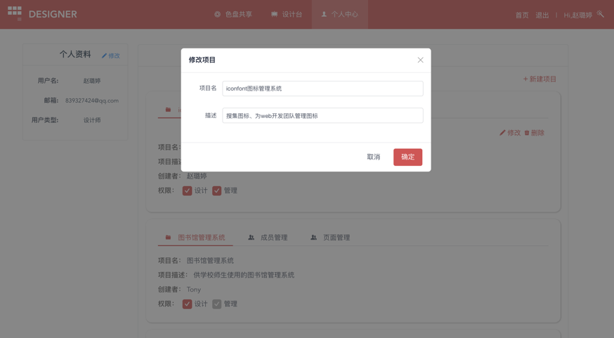  

“成员管理”板块展示该项目的所有成员及权限，当用户有管理权限时可对成员进行删除、添加、修改权限。策略设定界面如图5-4所示。
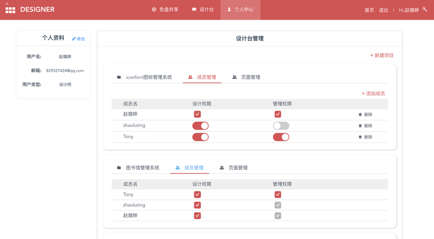  

点击“成员管理”板块右上角的“添加成员”按钮，会弹出添加弹窗，点击“确定”按钮即可添加项目成员。添加成员弹窗界面如图5-5所示。
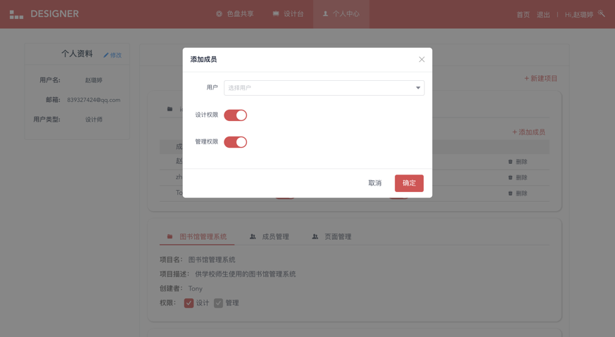  

“页面管理”板块展示该项目的所有模板页面，当用户有管理权限时可对页面进行删除、添加、修改权限，还可将指定模板页面复制到另一个项目中。页面管理板块如图5-6所示。
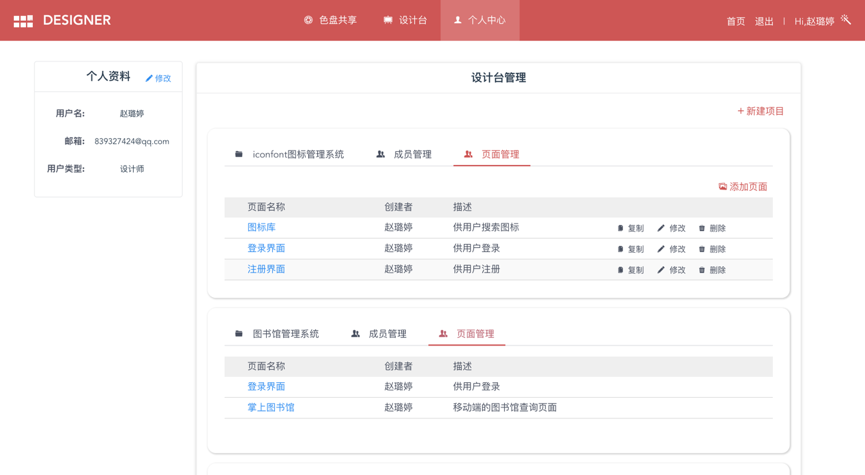  

点击“页面管理”板块右上角的“添加页面”按钮，会弹出新建弹窗，点击“确定”按钮即可添加模板页。新建页面弹窗界面如图5-7所示。
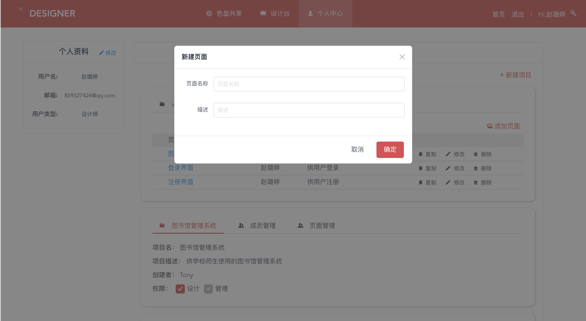  

点击表格每行右侧的“修改”按钮，会弹出修改弹窗，点击“确定”按钮即可对指定模板页进行详情修改操作。模板页修改弹窗界面如图5-8所示。
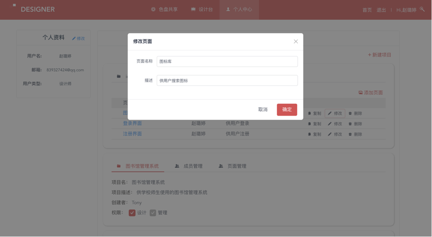
